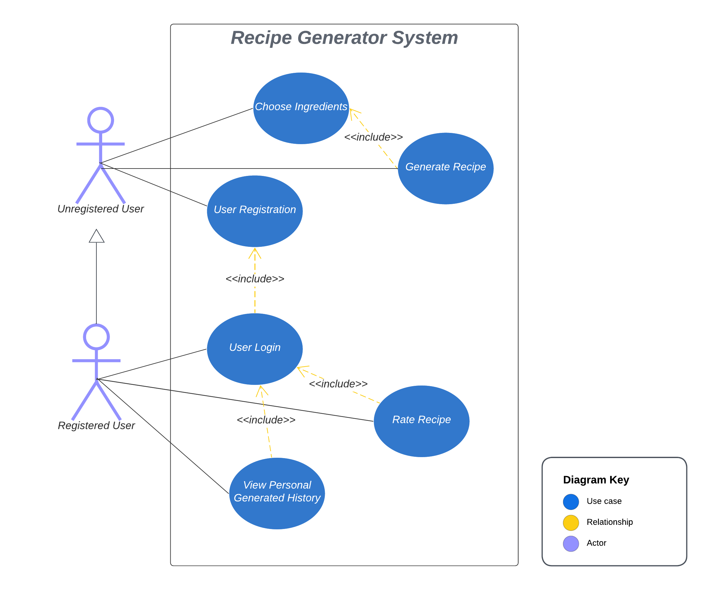

# groupx-recipe-generator

## Testing
### Unit Tests

```
npm install
npm test
```

## Acceptance Tests
:::info
Access the website at https://rg.discovery.cs.vt.edu/
:::

Use Cases Diagram



| Use Case               | Test Case               | Preconditions                          | Steps                                                  | Expected Result                                       |
|------------------------|-------------------------|----------------------------------------|--------------------------------------------------------|--------------------------------------------------------|
| Choose Ingredients     | Selecting Ingredients   |         | 1. Navigate to "Choose Ingredients" section.<br> 2. Select multiple ingredients.<br> 3. Confirm selection. | Selected ingredients are displayed correctly.          |
| Choose Ingredients     | Canceling Selection     | User has selected at least one ingredient | 1. Select some ingredients.<br> 2. Choose to cancel the selection. | The selection is canceled, and no changes are applied. |
| Generate Recipe        | Generating a Recipe      | User has selected ingredients         | 1. Click "Generate Recipe" button.<br> 2. Review the generated recipe. | A coherent recipe is generated with selected ingredients. |
| User Registration      | New User Registration    | User is not registered                | 1. Navigate to registration page.<br> 2. Fill in required information.<br> 3. Submit registration form. | User is registered; system confirms registration.     |
| User Login             | Existing User Login      | User is registered                    | 1. Navigate to login page.<br> 2. Enter valid credentials.<br> 3. Submit login form. | User is logged in and redirected to the home page.    |
| Rate Recipe            | Rating a Recipe          | 1. User is registered.<br> 2. User is logined.<br> 3.User has generated or viewed a recipe | 1. Go to recipe history page.<br> 2. Provide a rating - click stars.<br> 3. Save the rating - click "Rate" Button. | Rating is saved and reflected in the recipe history page.  |
| View Personal History  | Viewing Generated History|1. User is registered.<br> 2. User is logined.<br> 3. User has generated recipes            | 1. Navigate to "History" section.<br> 2. Review list of generated recipes. | User's generated history is displayed accurately.    |
